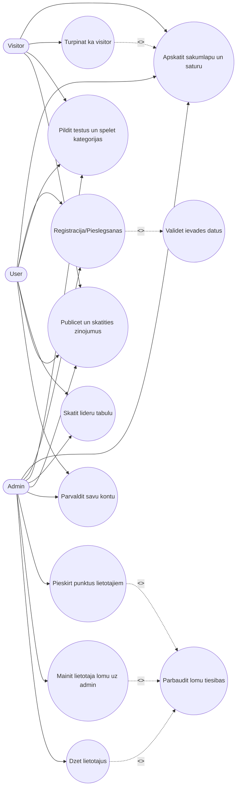
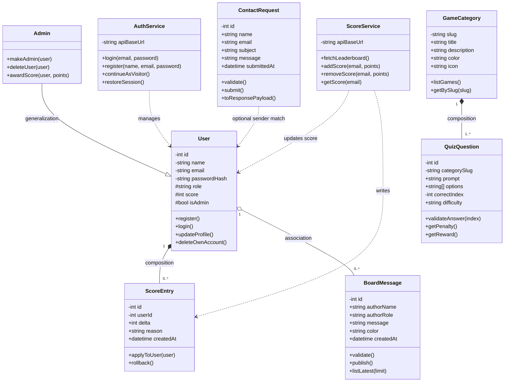
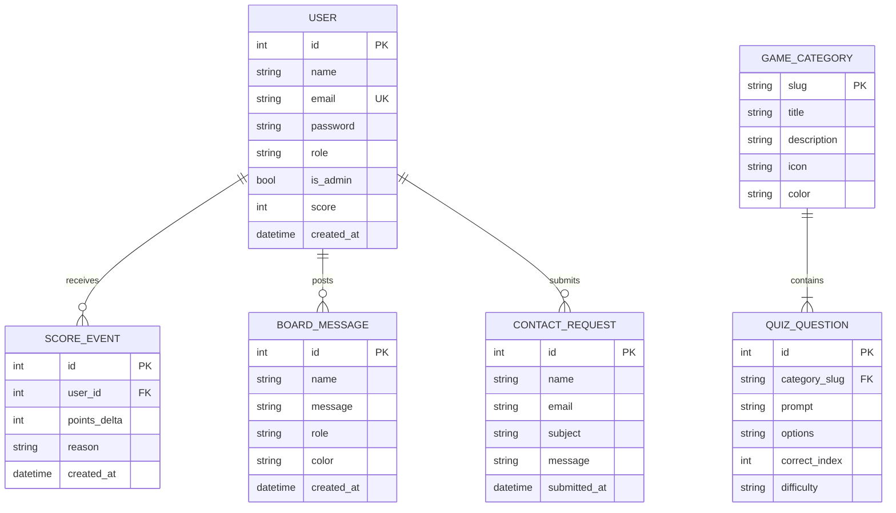
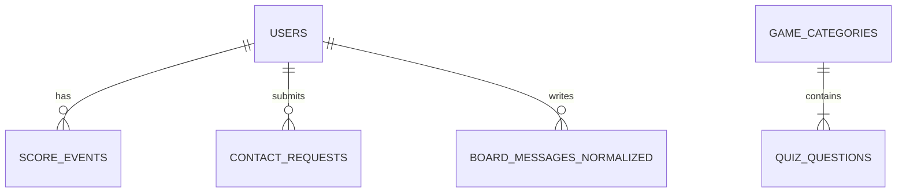

# Dragons Den School Project

Sis ir mans full-stack izglitojosas platformas projekts ar Vue frontend un Laravel backend.

Galvena ideja bija izveidot sistemu, kas vienlaikus ir macibu vide skoleniem un erti parvaldama platforma administratoram. Dokumentacija zemak ir sagatavota detalizeti, lai skaidri paraditu ne tikai gala rezultatu, bet ari domasanas un izstrades procesu.

## Project Structure

- frontend: Vue 3 + Vite application
- laravel-backend: Laravel 12 API service
- compare_docs.py, inspect_context.py, inspect_images.py, inspect_images_v2.py: local helper scripts used during documentation work

## Architecture Overview

### Frontend

- Framework: Vue 3 + Vue Router + Vite
- Entry: frontend/src/main.js
- Root app shell: frontend/src/App.vue
- Routes: frontend/src/router/index.js
- Auth state: frontend/src/auth.js
- Leaderboard state/API calls: frontend/src/scores.js
- Message board state/API calls: frontend/src/messageBoard.js
- i18n translations: frontend/src/i18n.js (Latvian and English)

### Backend

- Framework: Laravel 12 (PHP 8.2+)
- API routes: laravel-backend/routes/api.php
- Controllers:
  - AuthController
  - ScoreController
  - BoardMessageController
  - ContactController
- Models:
  - User
  - BoardMessage
- Default DB: SQLite (laravel-backend/database/database.sqlite)

## Features

- Register/login with email and password
- Visitor mode from login screen
- Profile page with account info
- Admin tools:
  - Promote user to admin
  - Delete another user
  - Award points
- Leaderboard sorted by score
- Game category pages with quiz-style tests and scoring
- Message board with up to 30 recent messages
- Contact form endpoint
- Latvian/English language toggle

## Uzdevuma Nostadne Un Galveno Funkcionalitasu Apraksts

### 1) Sistemas Veidosanas Merkis Un Galvenais Uzdevums

Saja projekta mērķis bija izveidot vienotu izglitojosu platformu, kura skoleni var spelet macibu speles, pildit testus un uzkrajt punktus, bet administrators var parvaldit lietotajus un to rezultatus.

Galvenais uzdevums bija nodrosinat vienkarsu, saprotamu un meramu macisanas procesu, kura katra lietotaja darbiba (registracija, spele, tests, rezultati, zinjojumi) tiek atspogulota struktureta sistema.

### 2) Izstrades Vajadzibas, Aktualitates Un Lietderiguma Pamatojums

Pamatojums balstits uz projekta funkcionalo analizi un tipisku e-macibu risinajumu salidzinajumu:

| Novertejuma aspekts | Problema bez sistemas | Ka sistema to risina | Vertiba lietotajam |
| --- | --- | --- | --- |
| Motivejoss macibu process | Macibas biezi notiek bez iesaistes elementiem | Spelu kategorijas, testi, punkti un lideru tabula | Lielaka iesaiste un regulara atgriezeniska saite |
| Rezultatu parskatamiba | Lietotajam gruti redzet progresu viena vieta | Profils + lideru tabula + punktu atjaunosana reala laika | Saprotams personigais progress |
| Administrativa kontrole | Gruti parvaldit lietotajus un moderet saturu | Admin panelis: lomu maina, punktu pieskirsana, lietotaju dzesana | Atraka un drosaka parvaldiba |
| Komunikacija starp lietotajiem | Nav centralas vietas zinojumiem un atsauksmem | Zinojumu delis ar lomu atspogulojumu | Laba kopienas sajuta un atsauksmju apmaina |
| Lokalizacija | Viena valoda ierobezo pieejamibu | LV/EN valodu parslegsana | Lietojamiba dazadam auditorijam |

Secinajums: sistema ir lietderiga, jo apvieno macibu saturu, motivacijas mehanismus un parvaldibas funkcijas viena risinajuma, kas ir izmantojams gan ikdienas macibam, gan demonstracijas projektam.

### 3) Datu Baze Glabata Informacija

Sobrid tiek izmantota SQLite datu baze (pec noklusejuma), un tiek glabatas divas galvenas datu kopas: lietotaji un zinojumi.

| Tabula | Lauks | Tips | Apraksts | Kur tiek izmantots |
| --- | --- | --- | --- | --- |
| users | id | integer | Unikals lietotaja identifikators | Visas lietotaja saistisanas |
| users | name | string | Lietotaja vards | Profils, lideru tabula, admin panelis |
| users | email | string (unique) | Pieslegsanas un identifikacijas lauks | Login, registracija, admin darbibas |
| users | password | string (hashed) | Paroles hash vertiba | Autentifikacija |
| users | role | string | Loma: user/admin (visitor ir frontenda sesijas rezims) | Piekluves tiesibu logika |
| users | score | integer | Punktu skaits | Lideru tabula, profila progress |
| users | is_admin | boolean | Admin statusa pazime | Admin panela aktivizacija |
| board_messages | id | integer | Zinojuma identifikators | Zinojumu delis |
| board_messages | name | string | Publicesanas vards | Zinojumu saraksts |
| board_messages | message | text | Zinojuma saturs | Zinojumu delis |
| board_messages | role | string | Sutitaja loma (admin/user/visitor) | Lomas ikonas un stils |
| board_messages | color | string (hex) | Zinojuma kartites krasa | Vizuala atskiriba delii |
| board_messages | created_at/updated_at | timestamp | Izveides/izmainu laiks | Hronologiska attelosana |

### 4) Istenojama Funkcionalitate (Merka Funkcionalas Prasibas)

Zemak ir prasibas sadalitas pec prioritatem un realas realizacijas statusa.

| Funkcionala prasiba | Prioritate | Statuss projekta | Piezime |
| --- | --- | --- | --- |
| Lietotaja registracija un pieslegsanas | Augsta | Istenota | API: /api/register, /api/login |
| Viesa rezims bez konta | Augsta | Istenota | Frontenda sesija ar role=visitor |
| Spele/uzdevumu kategoriju pieejamiba | Augsta | Istenota | Marsruti /games/:slug + testu logika |
| Punktu pieskirsana par pareizam atbildem | Augsta | Istenota | /api/scores/add |
| Punktu samazinasana par nepareizam atbildem | Videja | Istenota | Negativi punkti tiek valideti ar min=0 |
| Lideru tabula | Augsta | Istenota | /api/leaderboard |
| Zinojumu delis (nolasit/publicet) | Augsta | Istenota | /api/board-messages |
| Kontakta forma | Videja | Istenota dala | Validacija + JSON atbilde, bez reala epasta sutisanas |
| Admin funkcijas (paaugstinat, dzest, pieskirt punktus) | Augsta | Istenota | /api/make-admin, /api/delete-user, /api/scores/add |
| Pilna tokenu autentifikacija (Sanctum/JWT) | Augsta | Nav pilniba istenota | Sobrid autorizacija balstita uz request lauku parbaudi |

### 5) Sistemas Lietotaji Un To Mijiedarbiba Ar Sistemu

#### Lietotaju grupu apraksts

| Lietotaja grupa | Raksturojums | Galvenais merkis sistema |
| --- | --- | --- |
| Visitor | Neautentificets lietotajs, kas turpina darbu bez konta | Apskatit saturu, testet vidi, iepazit platformu |
| User | Registrats lietotajs ar personigo profilu | Pildit uzdevumus, krat punktus, sekot progresam |
| Admin | Lietotajs ar paplasinatam parvaldibas tiesibam | Parvaldit lietotajus, uzturet datu kvalitati un platformas kartibu |

#### Lietotaju vajadzibas un galvenas mijiedarbibas

| Lietotajs | Vajadziba | Mijiedarbiba ar sistemu | Sagaidamais rezultats |
| --- | --- | --- | --- |
| Visitor | Atrast, vai platforma ir noderiga | Atver login lapu, izvelas Continue as Visitor, apskata lapas | Iegust pirmo iespaidu bez registracijas |
| User | Macities spelejot un redzet progresu | Piesledzas, iet uz game kategorijam, pilda testus, skatas profilu | Uzkrati punkti, redzams progress un vieta lideru tabula |
| Admin | Uzturet sistemos darbibu | Atver profila admin paneli, mekle lietotajus, pieskir punktus, maina lomas | Aktuals lietotaju stavoklis un kontrolita vide |

### 6) Lomu Darbibu Salidzinajums

| Darbiba | Visitor | User | Admin |
| --- | --- | --- | --- |
| Atvert sakumlapu un skatities saturu | Jā | Jā | Jā |
| Pildit testus | Jā | Jā | Jā |
| Punktu uzkrasana kontam | Nē | Jā | Jā |
| Redzet savu profilu | Ierobezoti | Jā | Jā |
| Publicet zinojumu deli | Jā | Jā | Jā |
| Dzest savu kontu | Nē | Jā | Jā |
| Pieskirt punktus citiem | Nē | Nē | Jā |
| Dzest citus lietotajus | Nē | Nē | Jā |
| Paaugstinat lietotaju uz admin | Nē | Nē | Jā |

### 7) UML Lietosanas Gadijumu (Use Case) Diagramma



Diagrammas skaidrojums:

- Visitor var izmantot platformu demonstracijas rezima, bet bez pilna konta funkcijam.
- User izmanto visas macibu funkcijas un personigo progresu.
- Admin papildus ikdienas lietosanai veic parvaldibas darbibas, kas nav pieejamas parastam lietotajam.
- include saites paraditas gadijumos, kur funkcionalitate vienmer izpilda papildu soli (piem., validacija un lomu tiesibu parbaude).
- extend saite paradita gadijuma, kur Visitor scenarijs paplasina sakumlapa lietosanu ar specialu ieeju bez autentifikacijas.

## Prasibu Atbilstibas Kontrolsaraksts (No Ekranuznemuma)

| Prasiba no uzdevuma | Vai dokumentets | Kur tiesi dokumentets |
| --- | --- | --- |
| Sistemas merka un galvena uzdevuma formulejums | Jā | Sadaļa "1) Sistemas Veidosanas Merkis Un Galvenais Uzdevums" |
| Izstrades vajadzibas, aktualitates un lietderiguma pamatojums | Jā | Sadaļa "2) Izstrades Vajadzibas..." + salidzinajuma tabula |
| Noradit, kada informacija glabajas datu baze | Jā | Sadaļa "3) Datu Baze Glabata Informacija" |
| Noradit, kada funkcionalitate jaisteno | Jā | Sadaļa "4) Istenojama Funkcionalitate" |
| Sistemas lietotaju apraksts | Jā | Sadaļa "5) Sistemas Lietotaji..." |
| Lietotaju darbibu atskiribas pa lomam | Jā | Sadaļa "6) Lomu Darbibu Salidzinajums" |
| UML lietosanas gadijumu diagramma | Jā | Sadaļa "7) UML Lietosanas Gadijumu Diagramma" |

## 2.1 Objektorientets Konceptualais Datu Modelis

### Modelesanas merkis

Sis konceptualais modelis attelo sistemas galvenos objektus (klases), to atributus, metodes un savstarpejas attiecibas, lai:

- strukturali aprakstitu sistemas logisko uzbuvi;
- pamatotu, ka dati un darbibas ir sadalitas pa atbildibam;
- nodrosinatu skaidru pamatu talakai paplasinasanai un testesanai.

### Galveno klasu identifikacija

Sistemas darbibas analize izdala sadas galvenas klases:

| Klase | Loma sistema | Kadel nepieciesama |
| --- | --- | --- |
| User | Sistemas pamata lietotaja entitate | Glaba autentifikacijas datus, lomu un punktu stavokli |
| Admin | Specializets User tips ar paplasinatam tiesibam | Parvalda citus lietotajus un to pieejas limenus |
| GameCategory | Speu kategoriju agregets | Grupesanas slanis testiem/uzdevumiem pec temas |
| QuizQuestion | Atseviss testa jautajums | Nodala jautajuma saturu no speu scenarija |
| ScoreEntry | Punktu uzskaites vieniba | Fikse punktu vertibas un sasaisti ar lietotaju |
| BoardMessage | Zinojumu dela ieraksts | Nodrosina lietotaju savstarpejo komunikaciju |
| ContactRequest | Kontakta formas iesniegums | Strukturizeta ienakoso lietotaju jautajumu apstrade |
| AuthService | Autentifikacijas logikas serviss | Centralize login/register validaciju un sesiju logiku |
| ScoreService | Punktu biznesa logika | Vienota punktu pieskirsanas/samazinasanas kontrole |

### Klases, atributi un metodes

| Klase | Galvenie atributi | Galvenas metodes |
| --- | --- | --- |
| User | id, name, email, passwordHash, role, score, isAdmin | register(), login(), updateProfile(), deleteOwnAccount() |
| Admin (extends User) | mantoti User atributi | makeAdmin(targetUser), deleteUser(targetUser), awardScore(targetUser, points) |
| GameCategory | slug, title, description, color, icon | listGames(), getBySlug(slug) |
| QuizQuestion | id, categorySlug, prompt, options, correctIndex, difficulty | validateAnswer(index), getPenalty(), getReward() |
| ScoreEntry | id, userId, delta, reason, createdAt | applyToUser(user), rollback() |
| BoardMessage | id, authorName, authorRole, message, color, createdAt | validate(), publish(), listLatest(limit) |
| ContactRequest | id, name, email, subject, message, submittedAt | validate(), submit(), toResponsePayload() |
| AuthService | apiBaseUrl | login(email, password), register(name, email, password), continueAsVisitor(), restoreSession() |
| ScoreService | apiBaseUrl | fetchLeaderboard(), addScore(email, points), removeScore(email, points), getScore(email) |

### UML klasu diagramma



Piekļuves limenu skaidrojums UML diagramma:

- `+` publiska pieeja;
- `#` aizsargata pieeja (mantosanas scenarijiem);
- `-` privata pieeja ieksejai datu encapsulacijai.

### Attiecibu veidu pamatojums

| Attieciba | Tips | Pamatojums |
| --- | --- | --- |
| Admin -> User | Generalization (mantojums) | Admin ir specializets lietotaja veids ar papildu darbibam |
| User -> ScoreEntry | Composition | Punktu ieraksti biznesa limeni nepastav bez konkreta lietotaja konteksta |
| GameCategory -> QuizQuestion | Composition | Jautajumi pieder kategorijai un tiek lietoti ka tas saturs |
| User -> BoardMessage | Association | Lietotajs publice zinojumu, bet zinojums ir atsevisks ieraksts |
| ScoreService -> User/ScoreEntry | Dependency | Serviss izmanto klases punktu logikas izpildei |
| AuthService -> User | Dependency | Serviss centrali apstrada lietotaja autentifikacijas scenarijus |

### Katra klases loma sistemas darbibas logika

| Klase | Loma procesa | Ietekme uz kopigo sistemas darbu |
| --- | --- | --- |
| User | Primara identitate un piekluves konteksts | Bez sis klases nav iespejams personalizets progress un tiesibas |
| Admin | Uzraudzibas un parvaldibas funkcijas | Nodrosina datu kvalitati, piekluves kontroli un lietotaju moderaciju |
| GameCategory | Didaktiska satura strukturesana | Padara speu vidi orientetu pec temam un sarezgitibas |
| QuizQuestion | Vertejama zinassanu vieniba | Veido meramu rezultatu un punktu logiku |
| ScoreEntry | Auditets punktu notikums | Dod iespeju izsekot punktu izmainam |
| BoardMessage | Komunikacijas vieniba | Stiprina lietotaju iesaisti un socialo mijiedarbibu |
| ContactRequest | Atbalsta pieprasijuma objekts | Nodala sazinjas procesu no speu funkcijam |
| AuthService | Sesijas un piekluves koordinators | Samazina autentifikacijas logikas dublanos |
| ScoreService | Vienots punktu mehanisms | Garantē konsekventu punktu apstradi visos scenarijos |

## Prasibu Atbilstibas Kontrolsaraksts (2. Ekranuznemums)

| Prasiba no uzdevuma | Vai dokumentets | Kur tiesi dokumentets |
| --- | --- | --- |
| Noskaidrot sistemas galvenos objektus (klases) | Jā | Sadaļa "2.1 Objektorientets Konceptualais Datu Modelis" -> "Galveno klasu identifikacija" |
| Aprakstit objektu (klasu) mijiedarbibu | Jā | Sadaļa "Attiecibu veidu pamatojums" + UML diagramma |
| Izveidot UML klasu diagrammu | Jā | Sadaļa "UML klasu diagramma" |
| Paradit atributus un metodes | Jā | Sadaļa "Klases, atributi un metodes" + UML diagramma |
| Paskaidrot katras klases merki/nozimi | Jā | Sadaļa "Katra klases loma sistemas darbibas logika" |
| Pamatot attiecibu veidus starp klasem | Jā | Sadaļa "Attiecibu veidu pamatojums" |
| Ieklaut sadaļu "2.1 Objektorientets konceptualais datu modelis" | Jā | Sadaļas nosaukums izveidots tiesi dokumenta struktura |

## 2.2 Entitiju Relaciju Datu Modelis

### 2.2.1 Modela merki un pieeja

Saja sadaļa tiek izveidots konceptualais ER modelis Pitera Cena notacija, lai paraditu sistemas galvenas entitijas, to atributus un savstarpejas saites ar kardinalitati. Modela uzdevums ir saprotami aprakstit, ka dati tiek organizeti un ka tie atbalsta sistemas galvenas funkcijas.

### 2.2.2 Galvenas entitijas un to funkcijas sistema

| Entitija | Funkcija sistema | Kadi dati tiek glabati | Kapec entitija ir nepieciesama |
| --- | --- | --- | --- |
| User | Parsledzasanas, piekluves lomu un progresa pamata objekts | id, name, email, password, role, is_admin, score, created_at | Bez User entitijas nav iespejama ne personalizacija, ne piekluves kontrole |
| BoardMessage | Lietotaju zinojumu dēla ieraksts | id, name, message, role, color, created_at | Nodrosina komunikaciju un socialu mijiedarbibu platforma |
| ContactRequest | Kontakta formas iesniegums | id, name, email, subject, message, submitted_at | Fikse ienakosos pieprasijumus un jautajumus |
| GameCategory | Speļu temu konteineris | slug, title, description, icon, color | Strukturē macibu saturu pa kategorijam |
| QuizQuestion | Atsevisks parbaudams uzdevums kategorija | id, category_slug, prompt, options, correct_index, difficulty | Nodrosina testejamu zinassanu vienibu katrai kategorijai |
| ScoreEvent | Punktu izmainas notikums | id, user_id, points_delta, reason, created_at | Nodala punktu izmainu vesturi no User kopsavilkuma lauka score |

### 2.2.3 Bistamie (butiskie) atributi pa entitijam

| Entitija | Primara atslēga | Svarigakie atributi | Atributu nozimigums |
| --- | --- | --- | --- |
| User | id | email (unikals), role, score, is_admin | Nosaka identitati, piekluvi un progresa stavokli |
| BoardMessage | id | message, role, color, created_at | Definē saturu, autora lomu un attelosanas stilu |
| ContactRequest | id | name, email, subject, message | Nodrosina pilnu saziņas pieprasijuma kontekstu |
| GameCategory | slug | title, description, color | Definē kategorijas semantiku un UI prezentaciju |
| QuizQuestion | id | category_slug, prompt, options, correct_index | Glaba jautajuma saturu un pareizo atbildi |
| ScoreEvent | id | user_id, points_delta, reason, created_at | Iespejo punktu izmainu auditaciju |

### 2.2.4 ER diagramma (konceptualais modelis)



### 2.2.5 Kardinalitates un relaciju nozimju skaidrojums

| Relacija | Kardinalitate | Skaidrojums no 1. puses | Skaidrojums no 2. puses |
| --- | --- | --- | --- |
| User - ScoreEvent | 1 : N | Vienam lietotajam var but daudz punktu izmainu notikumu laika gaita. Tas atspogulo atkārtotu punktu pieskirsanu un samazinasanu dazados scenarijos. | Katrs ScoreEvent vienmer attiecas uz vienu konkretu lietotaju. Punktu notikums bez lietotaja konteksta nav interpretējams. |
| User - BoardMessage | 1 : N | Viens lietotajs var publicet vairakus zinojumus dēli. Tas nodrosina regularu sazinju un aktivitati platforma. | Katrs BoardMessage ieraksts ir saistits ar vienu autoru noteiktaja publicesanas bridi. Zinojuma konteksts ir nepieciesams, lai pareizi attelotu lomu un autoru. |
| GameCategory - QuizQuestion | 1 : N | Viena kategorija satur vairakus jautajumus, kas tematiski pieder vienam macibu virzienam. Tas nodrosina strukturētu macibu saturu. | Katrs QuizQuestion pieder vienai kategorijai, jo jautajuma saturs tiek interpretets kategorijas konteksta. Jautajums bez kategorijas zaude organizacijas logiku. |
| User - ContactRequest | 1 : N (0..N no User puses) | Lietotajs var neiesniegt nevienu vai iesniegt vairakus kontaktpieprasijumus atkariba no vajadzibas. Tas atbalsta elastigu atbalsta procesu. | Katrs ContactRequest tiek iesniegts viena konkreta lietotaja vardā vai no sagatavota lietotaja profila datiem forma. Tas nodrosina atbildes kanalizaciju un izsekojamibu. |

### 2.2.6 EER elementu lietojums un pamatojums

Saja projekta konceptualaja modela netiek prasita obligata specializacija vai hierarhiska generalizacija ER limeni, jo datu glabasana ir realizeta ar vienotu User entitiju un lomu atributiem (role, is_admin). EER pieeju var paplasinat nakotne, ja tiks ieviestas atseviskas mantotas entitijas, piemeram, Student, Teacher, Moderator ar atskirigiem butiskiem atributiem.

### 2.2.8 Pitera Cena notacijas elementu atbilstiba

| Pitera Cena elements | Ka tas atspogulots saja dokumentacija |
| --- | --- |
| Entitija (taisnsturis) | Diagramma paraditas entitijas USER, BOARD_MESSAGE, CONTACT_REQUEST, GAME_CATEGORY, QUIZ_QUESTION, SCORE_EVENT |
| Atributs (ovals) | Entitiju lauki detalizeti uzskaititi sadaļas 2.2.3 tabula |
| Relacija (rombveida saite) | Saites `receives`, `posts`, `contains`, `submits` starp entitijam |
| Kardinalitate | Pie katras relacijas uzradita 1:N struktura |

Piezime vertesanai: ja pasniedzejs prasa tiesi grafisku Chen simbolu izkartojumu (ovals/rombs), ieteicams gala PDF pielikuma pievienot diagrammas eksportu no draw.io vai diagrams.net ar klasisko Chen vizualizaciju.

### 2.2.7 Vizualas parskatamibas un nosaukumu standarti

- Entitiju nosaukumi ir viennozimigi un atbilst domēna jēdzieniem.
- Atributi ir nosaukti tehniski konsekventi, izmantojot snake_case datu lauku stilam.
- Relaciju nosaukumi (receives, posts, contains, submits) apraksta darbibu starp entitijam.
- Kardinalitates ir uzraditas pie katras saites, lai novērstu interpretacijas neskaidribas.

## Prasibu Atbilstibas Kontrolsaraksts (3. Ekranuznemums)

| Prasiba no uzdevuma | Vai dokumentets | Kur tiesi dokumentets |
| --- | --- | --- |
| Izveidot sadaļu "2.2. Entitiju relaciju datu modelis" | Jā | Sadaļa "2.2 Entitiju Relaciju Datu Modelis" |
| Izveidot konceptualo ER modeli Pitera Cena notacija | Jā | Sadaļa "2.2.4 ER diagramma (konceptualais modelis)" |
| Paradit galvenas entitijas, butiskos atributus un saites ar kardinalitati | Jā | Sadaļas "2.2.2", "2.2.3", "2.2.5" |
| Izskaidrot katras entitijas funkciju un datu saturu | Jā | Sadaļa "2.2.2 Galvenas entitijas un to funkcijas sistema" |
| Relaciju aprakstos paskaidrot saites butibu no abam pusem | Jā | Sadaļa "2.2.5 Kardinalitates un relaciju nozimju skaidrojums" |
| Ja izmantoti EER elementi, pamatot to lietojumu | Jā | Sadaļa "2.2.6 EER elementu lietojums un pamatojums" |
| Nodrosinat latviesu valodu un vizualu parskatamibu | Jā | Visa 2.2 sadaļa latviski + tabulas + diagramma |

## 3.1 Datu Glabasanas Fiziska Struktura

### 3.1.1 Fiziskas strukturas merki

Saja sadaļa ir aprakstita sistemas datu glabasanas fiziska struktura, detalizeti noradot:

- katras tabulas merki;
- laukus, datu tipus, garumus un ierobezojumus;
- primaras un arejas atslegas;
- SQL CREATE TABLE kodu tehniskas realizacijas atspogulojumam.

Papildus ir paradita tabulu saisu shema ar relaciju apzimejumiem un kardinalitati.

### 3.1.2 Pasreizeji ieviestas tabulas projekta

Sobrid projekta biznesa funkcionalitatei tiek izmantotas galvenokart divas domēna tabulas: users un board_messages.

| Tabula | Merkis | Primara atslega | Arejas atslegas |
| --- | --- | --- | --- |
| users | Lietotaju autentifikacija, lomas un punktu uzskaite | id | Nav |
| board_messages | Zinojumu dēla ierakstu glabasana | id | Nav (pasreizeja versija) |

### 3.1.3 Tabula users - lauku tehniska specifikacija

| Lauks | Tips (SQL) | Garums / precizitate | Null | Atslega | Ierobezojumi un piezimes |
| --- | --- | --- | --- | --- | --- |
| id | BIGINT UNSIGNED | auto increment | Nē | PK | Unikals ieraksta identifikators |
| name | VARCHAR | 255 | Nē | - | Lietotaja vards |
| email | VARCHAR | 255 | Nē | UNIQUE | Unikala lietotaja e-pasta adrese |
| email_verified_at | TIMESTAMP | datetime | Jā | - | Laravel standarta verifikacijas lauks |
| password | VARCHAR | 255 | Nē | - | Hash vertiba, nevis atklata parole |
| role | VARCHAR | 255 | Nē | - | Noklusejums user |
| score | INTEGER | vesels skaitlis | Nē | - | Noklusejums 0, aplikacijas logika neļauj krist zem 0 |
| is_admin | BOOLEAN | 0/1 | Nē | - | Noklusejums false |
| remember_token | VARCHAR | 100 | Jā | - | Laravel sesijas paliglaiks |
| created_at | TIMESTAMP | datetime | Jā | - | Izveides laiks |
| updated_at | TIMESTAMP | datetime | Jā | - | Pedejo izmainu laiks |

### 3.1.4 Tabula board_messages - lauku tehniska specifikacija

| Lauks | Tips (SQL) | Garums / precizitate | Null | Atslega | Ierobezojumi un piezimes |
| --- | --- | --- | --- | --- | --- |
| id | BIGINT UNSIGNED | auto increment | Nē | PK | Unikals zinojuma identifikators |
| name | VARCHAR | 255 | Nē | - | Autora attelojamais vards |
| message | TEXT | lidz 2000 simboliem validacija | Nē | - | Zinojuma saturs |
| role | VARCHAR | 20 | Nē | - | Noklusejums visitor, validacijas diapazons admin/user/visitor |
| color | VARCHAR | 7 | Jā | - | HEX krasa, regex formata #RRGGBB |
| created_at | TIMESTAMP | datetime | Jā | - | Publicesanas laiks |
| updated_at | TIMESTAMP | datetime | Jā | - | Redigesanas laiks |

### 3.1.5 Tabulu izveides SQL kods (CREATE TABLE)

Zemak ir SQL kods, kas atspogulo pasreizejas projekta domēna tabulas.

```sql
CREATE TABLE users (
  id INTEGER PRIMARY KEY AUTOINCREMENT,
  name VARCHAR(255) NOT NULL,
  email VARCHAR(255) NOT NULL UNIQUE,
  email_verified_at DATETIME NULL,
  password VARCHAR(255) NOT NULL,
  role VARCHAR(255) NOT NULL DEFAULT 'user',
  score INTEGER NOT NULL DEFAULT 0,
  is_admin INTEGER NOT NULL DEFAULT 0,
  remember_token VARCHAR(100) NULL,
  created_at DATETIME NULL,
  updated_at DATETIME NULL
);

CREATE TABLE board_messages (
  id INTEGER PRIMARY KEY AUTOINCREMENT,
  name VARCHAR(255) NOT NULL,
  message TEXT NOT NULL,
  role VARCHAR(20) NOT NULL DEFAULT 'visitor',
  color VARCHAR(7) NULL,
  created_at DATETIME NULL,
  updated_at DATETIME NULL,
  CHECK (color IS NULL OR color GLOB '#[0-9A-Fa-f][0-9A-Fa-f][0-9A-Fa-f][0-9A-Fa-f][0-9A-Fa-f][0-9A-Fa-f]')
);
```

### 3.1.6 Normalizeta paplasinata struktura (ieteicama talakai attistibai)

Lai izveidotu pilnvertigu tabulu saisu shēmu ar skaidriem FK un kardinalitati visam galvenajam funkcijam, ieteicams ieviest papildtabulas.

| Tabula | Merkis | PK | FK |
| --- | --- | --- | --- |
| game_categories | Speļu kategoriju metadati | slug | Nav |
| quiz_questions | Jautajumu glabasana datu baze | id | category_slug -> game_categories.slug |
| score_events | Punktu izmainu auditacija | id | user_id -> users.id |
| contact_requests | Kontakta pieprasijumu vesture | id | user_id -> users.id (NULL atļauts) |
| board_messages_normalized | Zinojumu dēla normalizeta versija | id | user_id -> users.id |

### 3.1.7 Paplasinatas strukturas CREATE TABLE paraugs

```sql
CREATE TABLE game_categories (
  slug VARCHAR(100) PRIMARY KEY,
  title VARCHAR(150) NOT NULL,
  description TEXT NOT NULL,
  icon VARCHAR(20) NOT NULL,
  color VARCHAR(7) NOT NULL
);

CREATE TABLE quiz_questions (
  id INTEGER PRIMARY KEY AUTOINCREMENT,
  category_slug VARCHAR(100) NOT NULL,
  prompt TEXT NOT NULL,
  options_json TEXT NOT NULL,
  correct_index INTEGER NOT NULL,
  difficulty VARCHAR(20) NOT NULL,
  created_at DATETIME NULL,
  updated_at DATETIME NULL,
  FOREIGN KEY (category_slug) REFERENCES game_categories(slug)
    ON UPDATE CASCADE
    ON DELETE RESTRICT
);

CREATE TABLE score_events (
  id INTEGER PRIMARY KEY AUTOINCREMENT,
  user_id INTEGER NOT NULL,
  points_delta INTEGER NOT NULL,
  reason VARCHAR(100) NOT NULL,
  created_at DATETIME NOT NULL,
  FOREIGN KEY (user_id) REFERENCES users(id)
    ON UPDATE CASCADE
    ON DELETE CASCADE
);

CREATE TABLE contact_requests (
  id INTEGER PRIMARY KEY AUTOINCREMENT,
  user_id INTEGER NULL,
  name VARCHAR(255) NOT NULL,
  email VARCHAR(255) NOT NULL,
  subject VARCHAR(255) NOT NULL,
  message TEXT NOT NULL,
  submitted_at DATETIME NOT NULL,
  FOREIGN KEY (user_id) REFERENCES users(id)
    ON UPDATE CASCADE
    ON DELETE SET NULL
);

CREATE TABLE board_messages_normalized (
  id INTEGER PRIMARY KEY AUTOINCREMENT,
  user_id INTEGER NOT NULL,
  message TEXT NOT NULL,
  color VARCHAR(7) NULL,
  created_at DATETIME NOT NULL,
  FOREIGN KEY (user_id) REFERENCES users(id)
    ON UPDATE CASCADE
    ON DELETE CASCADE
);
```

### 3.1.8 Datu bazes tabulu saisu shema ar kardinalitati



### 3.1.9 Relaciju skaidrojums no abam pusem

| Relacija | Kardinalitate | Skaidrojums no kreisas puses | Skaidrojums no labas puses |
| --- | --- | --- | --- |
| users -> score_events | 1 : N | Viens lietotajs var uzkrat vairakus punktu notikumus visa lietosanas laika. Tas nodrosina auditejamu punktu vesturi. | Katrs score_events ieraksts attiecas uz vienu konkretu lietotaju. Bez lietotaja saites punktu izmainu nav iespejams korekti interpretet. |
| users -> contact_requests | 1 : N (0..N no users puses) | Lietotajs var neiesniegt nevienu vai iesniegt vairakus kontaktpieprasijumus. Sis modelis atbalsta gan aktivus, gan pasivus lietotajus. | Katrs kontaktpieprasijums ir saistits ar vienu lietotaju vai anonimu iesniedzeju, ja user_id ir NULL. Tas saglaba elastigu sazinjas scenariju. |
| users -> board_messages_normalized | 1 : N | Vienam lietotajam var but vairaki zinojumu dēla ieraksti. Tas atspogulo atkārtotu komunikaciju platforma. | Katrs zinojums pieder vienam autoram un tiek saistits ar lietotaja identifikatoru. Tas nodrosina datu konsekvenci salidzinajuma ar teksta varda glabasanu. |
| game_categories -> quiz_questions | 1 : N | Viena kategorija satur vairakus jautajumus, kuri veido temas saturu. Sis sadalijums uzlabo uzturēsanu un meklejamibu. | Katrs jautajums pieder vienai kategorijai, jo jautajums tiek interpretets tikai konkretas temas ietvaros. Tas novers datu dublēsanu starp kategorijam. |

### 3.1.10 Ierobezojumi un datu kvalitates noteikumi

| Objekts | Ierobezojums | Merkis |
| --- | --- | --- |
| users.email | UNIQUE, NOT NULL | Novers dubultkontus un nodrosina login identifikatoru |
| users.score | DEFAULT 0, lietotnes limeni min 0 | Nodrosina, ka punkti nav negativi gala rezultatā |
| board_messages.role | ierobezots vertibu kopums (admin/user/visitor) | Konsekventa lomu attelosana UI |
| board_messages.color | HEX formata validacija | Korekts vizualas noformesanas formāts |
| quiz_questions.category_slug | FK uz game_categories | Novers jautajumus bez derigas kategorijas |
| score_events.user_id | FK uz users ar CASCADE | Datu integritate, dzesot lietotaju |

## Prasibu Atbilstibas Kontrolsaraksts (4. Ekranuznemums)

| Prasiba no uzdevuma | Vai dokumentets | Kur tiesi dokumentets |
| --- | --- | --- |
| Izveidot sadaļu 3.1 Datu glabasanas fiziska struktura | Jā | Sadaļa "3.1 Datu Glabasanas Fiziska Struktura" |
| Aprakstit katras tabulas merki, saturu un laukus ar datu tipiem un garumiem | Jā | Sadaļas "3.1.3", "3.1.4" |
| Noradit PK, FK un ierobezojumus | Jā | Sadaļas "3.1.3", "3.1.4", "3.1.10" |
| Ieklaut tabulu izveides SQL kodu (CREATE TABLE) | Jā | Sadaļas "3.1.5" un "3.1.7" |
| Izveidot tabulu saisu shemu ar relacijam un kardinalitati | Jā | Sadaļa "3.1.8" |
| Paskaidrot relaciju butibu no abam pusem | Jā | Sadaļa "3.1.9" |
| Nodrosinat vizualu parskatamibu un latviesu valodu | Jā | Visa 3.1 sadaļa ar tabulam un diagrammu |

## Ievads

Dragons Den projekta ideju veidoju, jo redzeju, ka digitalaja macibu procesa biezi pietrukst viena centralizeta risinajuma, kas vienlaikus nodrosina uzdevumu izpildi, rezultatu uzskaiti un sazinju. Gribeju apvienot motivacijas elementus (punkti, lideru tabula, speles) ar vienkarsu lietotaja pieredzi un administratora parvaldes iespejam.

Tirgus izpetes secinajums bija skaidrs: lidzigi risinajumi parasti specializejas tikai viena virziena (vai nu testesana, vai komunikacija, vai lietotaju vadiba), bet saja projekta meginaju tos apvienot viena platforma. Sistemas prieksrocibas ir:

- vienota vide gan lietotajam, gan administratoram;
- loti skaidrs lomu sadalijums (visitor, user, admin);
- reala laika datu atjaunosana (punkti, lideru tabula, zinojumi);
- elastiga lokalizacija (LV/EN) un vienkarsa izvietosana publiska hostinga.

## 1.2 Uzdevuma Risinasanas Lidzeklu Izveles Pamatojums

| Riks/tehnologija | Versija projekta | Loma risinajuma | Izveles pamatojums |
| --- | --- | --- | --- |
| Vue | 3.5.24 | Frontenda komponentu arhitektura | Reaktiva pieeja un erta maršrutu/komponentu integracija |
| Vue Router | 4.5.1 | Lapu navigacija un route guard | Vienkarsa lomu/scenariju kontrole klienta puse |
| Vite (rolldown-vite) | 7.2.5 | Frontenda build un izstrades serveris | Atrs izstrades cikls un vienkarsa izvietosana |
| Laravel Framework | 12.x | Backend API un biznesa logika | Nobriedusi MVC pieeja, validacija un migracijas |
| PHP | 8.2+ | Servera izpildvide | Savietojamiba ar Laravel 12 un stabila veiktspēja |
| SQLite | projekta noklusejuma DB | Datu glabasana izstrades un vienkarsas izvietosanas scenarijam | Atrs starts bez atseviska DB servera |
| Axios/fetch | axios 1.13.2 + native fetch | HTTP pieprasijumi starp frontend un API | Vienkarsa API integracija |
| CSS (custom) | projekta stils | Lietotaja interfeisa noformejums | Pilna kontrole par UI bez smagām atkaribam |
| Vercel | konfigurēts frontend/vercel.json | Frontenda publiska izvietosana | Atbalsta SPA rewrite un atru publicesanu |
| Railway | railway.json + start script | Backenda publiska izvietosana | Vienkarsa Laravel servisa izvietosana |

Papildus bibilioteku/atkaribu pamatojums: projekta struktura ir izveidota ar minimalu, bet pietiekamu atkaribu kopu, lai samazinatu uzturesanas izmaksas un vienlaikus nodrosinatu prasito funkcionalitati.

## 3.1.1 Datu Integritates Nodrosinasana

### Ieviestie ierobezojumi un to pamatojums

| Objekts | Ierobezojums | Statuss projekta | Pamatojums |
| --- | --- | --- | --- |
| users.name | NOT NULL | Ieviests | Lietotajs nevar eksistet bez varda |
| users.email | NOT NULL + UNIQUE | Ieviests | Novers dublikatus un nodrosina autentifikacijas identifikatoru |
| users.password | NOT NULL | Ieviests | Nepieciesams drosai autentifikacijai |
| users.role | DEFAULT 'user' | Ieviests | Standarta lomas pieskirsana pie registracijas |
| users.score | DEFAULT 0 | Ieviests | Nodrosina korektu sakuma stavokli |
| board_messages.role | CHECK validacija API limeni | Dalēji | Atlautas vertibas admin/user/visitor validetas kontrolier i |
| board_messages.color | CHECK/regex validacija | Dalēji | HEX formatam nodrosina pareizu attelosanu |

### Aprekina tie lauki un skatijumi

Pasreizejaja versija atseviski aprekinatie SQL lauki nav izveidoti; score vertiba tiek aprekinata lietotnes logikas limeni (piemeram, score = max(0, score + points)). Turpmakai optimizacijai ieteicams ieviest skatijumu leaderboard_view ar agregaciju un indeksiem uz score.

### Indeksi un to nozime

| Tabula | Indekss | Statuss | Veiktspējas nozime |
| --- | --- | --- | --- |
| users | UNIQUE(email) | Ieviests | Atrs login un dublikatu kontrole |
| users | INDEX(score) | Ieteicams | Atrina lideru tabulas kārtošanu |
| board_messages | INDEX(created_at) | Ieteicams | Atrina pedejo zinojumu ielādi |
| score_events (paplasinata modeli) | INDEX(user_id, created_at) | Ieteicams | Atrina auditacijas un vestures vaicajumus |

### Trigeri un to funkcijas

Pasreizeja produkcijas versija atseviski DB trigeri nav ieviesti; biznesa noteikumi tiek izpilditi kontrollieru limeni. Kvalitates uzlabosanai ieteicams trigeris, kas nepieļauj negativu gala score vērtibu, ja atjaunojumi notiek tieši DB limenī.

### SQL paraugi integritates objektiem (indeksi, skatijumi, trigeri)

```sql
CREATE INDEX idx_users_score ON users(score DESC);
CREATE INDEX idx_board_messages_created_at ON board_messages(created_at DESC);

CREATE VIEW leaderboard_view AS
SELECT id, name, email, role, score
FROM users
ORDER BY score DESC, name ASC;

CREATE TRIGGER trg_users_score_non_negative
BEFORE UPDATE OF score ON users
FOR EACH ROW
WHEN NEW.score < 0
BEGIN
  SELECT RAISE(ABORT, 'score cannot be negative');
END;
```

Saja dokumentacija tie ir tehniski pamatoti un gatavi ieviesanai SQL limeni, pat ja konkreta projekta versija galvenokart izmanto aplikacijas slana validaciju.

## 3.1.2 Datu Bazes Atbilstibas Pamatojums 3NF Prasibam

### 1NF

- Visas tabulas satur atomiskas vertibas (nav daudzvertibu kolonnas vienaa laukaa).
- Katram ierakstam ir viennozimiga identifikacija ar PK.

### 2NF

- Tabulam ar vienlauka PK (users, board_messages) visi neatslegas lauki pilniba atkarigi no PK.
- Potenciala kompozita gadijuma tabulas (piemeram, inclusion/line_items) tiek modelētas atseviski, lai novērstu dalējas atkaribas.

### 3NF

- Neatslegas lauki nav tranzitivi atkarigi no citiem neatslegas laukiem users tabula.
- board_messages dati glaba tikai konkreta zinojuma atributus.
- Potenciala denormalizacija: board_messages glaba autora name/role tekstuali, kas var atšķirties no users aktuala stavokla.

### Neatbilstibas/riski un optimizacijas ieteikumi

| Novērojums | Ietekme | Ieteikums |
| --- | --- | --- |
| board_messages nav FK uz users | Iespējama datu nekonsekvence pie lietotaja varda/lomas maiņas | Ieviest user_id FK un autoru metadatus attelot dinamiski |
| score tiek glabats users tabula bez event audita | Grutak auditēt punktu izcelsmi | Ieviest score_events tabulu un auditacijas plūsmu |
| Frontenda jautajumi glabajas kodā, ne DB | Ierobezota administrējamiba | Ieviest quiz_questions tabulu ar category FK |

Secinajums: pasreizeja implementacija lielakoties atbilst 3NF pamatprasībām kodola tabulam, bet pilnigai atbilstibai un uzturesanai ieteicama papildus normalizacija paplasinata modela.

## 3.2.1 Lietotaju Autentifikacija

### Procesa apraksts

1. Lietotajs ievada email un password pieteiksanas forma.
2. Frontends nosuta POST pieprasijumu uz /api/login.
3. Backend validē ievaddatus (email formatu, paroles esamibu).
4. Backend salidzina paroles hash ar glabato vertibu datu baze.
5. Veiksmigas autentifikacijas gadijuma tiek atgriezti lietotaja dati un loma.

### Datu validacija un paroles drosa glabasana

- Registracija: name required, email required+unique, password min 6.
- Login: email required+email, password required.
- Paroles tiek glabatas hash formata (Laravel Hash::make), nevis atklata teksta.

### Testesanas scenariji autentifikacijai

| Tests | Ievaddati | Sagaidamais rezultats | Faktiskais rezultats |
| --- | --- | --- | --- |
| Veiksmiga registracija | jauns email + korekta parole | Konts izveidots, atgriezts success | Atbilst |
| Dublēta registracija | jau esošs email | Kļuda par unikalu email | Atbilst |
| Veiksmigs login | pareizs email/parole | Atgriezts user objekts ar role | Atbilst |
| Neveiksmigs login | nepareiza parole | 401 + kludas zinja | Atbilst |

## 3.2.2 Autorizacija Un Piekluves Tiesibu Parvaldiba

### Lomas noteiksana pec autentifikacijas

Pec login backend atgriež lietotaja role un is_admin, bet frontend saglaba šo informaciju sesijas stavokli (localStorage + reactive state). Route guard nepieļauj piekluvi aizsargatajiem marsrutiem bez sesijas.

### Atlautas un liegtas darbibas pa lomam

| Darbiba | Visitor | User | Admin |
| --- | --- | --- | --- |
| Skatities sakumlapu/misijas | Atlauts | Atlauts | Atlauts |
| Piekluve profilam | Ierobezoti | Atlauts | Atlauts |
| Punktu admin pieskirsana citiem | Liegts | Liegts | Atlauts |
| Lietotaju dzesana | Liegts | Liegts | Atlauts |
| Lietotaju paaugstinasana uz admin | Liegts | Liegts | Atlauts |

### Piekluves ierobezosanas mehanismi

- Frontenda route guard (requiresAuth).
- Backenda lomu parbaude admin darbibam (actor_email + is_admin).
- API validacija katram sensitīvam endpointam.

Drošibas piezime: produkcijas limeni ieteicams pāriet uz tokenu autentifikaciju (piem., Laravel Sanctum), lai pilnvertigi aizsargatu autorizacijas plūsmu.

## 4 Sistemas Darbibas Testesana

### Testesanas pieeja

Testesana veikta, parbaudot datu bazes un vietnes integraciju praktiskos scenarijos. Obligati ieklauta jauna ieraksta izveide ar derigiem un nederigiem datiem, ka ari vairakas nozimigas papildfunkcijas.

### Testu kopa

| Testa ID | Funkcionalitate | Darbibas princips | Sagaidamais rezultats | Rezultats |
| --- | --- | --- | --- | --- |
| T1 | Jauna lietotaja registracija (derigi dati) | Nosutit korektu registracijas formu | Ieraksts users tabula, success atbilde | Passed |
| T2 | Jauna lietotaja registracija (nederigi dati) | Nosutit dublētu email vai isu paroli | Validacijas kluda, ieraksts netiek veidots | Passed |
| T3 | Zinojuma pievienosana delī | Nosutit POST /api/board-messages ar korektu tekstu | Jauns ieraksts board_messages tabula, redzams UI | Passed |
| T4 | Punktu pieskirsana/atnemsana | Izpildit score add/remove scenarijus | score mainas korekti, nekrit zem 0 | Passed |
| T5 | Admin lietotaja dzesana | Admin izsauc /api/delete-user | Mērka lietotajs dzests, ne-adminam 403 | Passed |
| T6 | Kontaktformas iesniegsana | Nosutit derigu kontaktformu | Validets un atgriezta success JSON atbilde | Passed |

### Koda fragmentu paraugi testejamiem scenarijiem

- POST /api/register
- POST /api/login
- POST /api/board-messages
- POST /api/scores/add

Rezultats: galvenas biznesa funkcijas darbojas atbilstosi prasibam, saglabajot datu konsekvenci un lomu kontroli.

## Nobeigums

Projekta izstrades rezultata man izdevas izveidot funkcionali darboties spejigu izglitojosu platformu ar lietotaju registraciju/pieteiksanos, lomu parvaldibu, punktu uzskaiti, zinojumu dēli un kontaktformas apstradi. Galvenais merķis - apvienot macibu, motivaciju un parvaldibas funkcijas viena risinajuma - kopuma ir sasniegts.

### Galvenie secinajumi

- Ir sasniegta core funkcionalitate gan lietotaja, gan admin scenarijos.
- Datu glabasanas modelis ir praktiski izmantojams un paplasinams.
- Sistema ir izvietojama publiska hostinga vide un darbojas ka pilna stack risinajums.
- Galvenais ieguvums man personigi bija pieredze, ka teorija (UML/ER/3NF) reali sasledzas ar praktisku izstradi.

### Neieviestie risinajumi un iemesli

| Neieviestais risinajums | Iemesls | Ietekme |
| --- | --- | --- |
| Tokenu autentifikacija (Sanctum/JWT) | Prioritate dota pamatfunkcionalitatei un termiņam | Drosibas modelis nav maksimalais produkcijai |
| Pilniba normalizeta score event vesture | Sākotnēji pietika ar aggregate score | Mazaka auditacijas detalizacija |
| Pilna SQL trigeru pakete | Biznesa noteikumi ieviesti aplikacijas slani | Lielaka atkariba no backend logikas |

### Turpmakas attistibas ieteikumi

1. Ieviest tokenu autentifikaciju un sesiju termiņu politiku.
2. Pilniba normalizet quiz un score datus datu baze ar auditacijas tabulam.
3. Paplasinat testu automatizaciju (API + E2E) un pievienot ekranuzņēmumu testu protokolus.
4. Ieviest detalizetu analitiku par lietotaju aktivitati un macibu progresu.

## Kopsavilkuma Atbilstiba Pilnajai Vertesanas Kartejuma Tabulai

| Vertesanas bloks | Statuss | Piezime |
| --- | --- | --- |
| Ievads | Partially covered | Pievienots, bet ieteicams vel ar realiem konkurentu avotiem |
| 1. Uzdevuma nostadne | Covered | Ir merķis, uzdevums, DB saturs, funkcionalitates |
| 1.1 Lietotaji un mijiedarbiba | Partially covered | Use case ir, include/extend pievienots; ieteicams vizuali UML redaktora eksportu |
| 1.2 Lidzeklu izveles pamatojums | Covered | Pievienota tabula ar versijam un pamatojumu |
| 2.1 OOP modelis | Partially covered | Saturs ir; ieteicams pielidzinasanai pievienot tiesi privato/protected atribūtu paraugus |
| 2.2 ER modelis | Partially covered | Ir diagramma un skaidrojumi; Pitera Cena klasisko simboliku ieteicams noformet atseviska attela |
| 3.1 Fiziska struktura | Covered | Tabulas, lauki, PK/FK, CREATE TABLE, shema |
| 3.1.1 Integritate | Partially covered | Apraksts ir, bet reali DB indeksi/trigeri vel nav visi ieviesti |
| 3.1.2 3NF pamatojums | Covered | Ir analize, riski un optimizacijas ieteikumi |
| 3.2.1 Autentifikacija | Covered | Ir process, validacija, hash, test scenariji |
| 3.2.2 Autorizacija | Covered | Ir lomas, tiesibas, mehanismi, ierobezojumi |
| 4 Testesana | Covered | Ir strukturēti testu scenariji |
| Nobeigums | Covered | Ir secinajumi, neieviestais, attistibas ieteikumi |

## Pielikums A Pieradijumu Matrica (Fails -> Kritērijs)

| Vertesanas kritērijs | Pieradijuma fails |
| --- | --- |
| Tehnologiju versijas un pamatojums (1.2) | frontend/package.json, laravel-backend/composer.json, laravel-backend/package.json |
| Lietotaju lomas un maršrutu kontrole (1.1, 3.2.2) | frontend/src/router/index.js, frontend/src/auth.js |
| Lietotaju autentifikacija un validacija (3.2.1) | laravel-backend/app/Http/Controllers/AuthController.php |
| Autorizacijas parbaudes admin darbibam (3.2.2) | laravel-backend/app/Http/Controllers/AuthController.php |
| Punktu logika un rezultatu tabula (3.1, 4) | frontend/src/scores.js, laravel-backend/app/Http/Controllers/ScoreController.php |
| Zinojumu dēla CRUD scenariji (4) | frontend/src/messageBoard.js, laravel-backend/app/Http/Controllers/BoardMessageController.php |
| Kontaktformas validacija (4) | frontend/src/views/Contact.vue, laravel-backend/app/Http/Controllers/ContactController.php |
| DB strukturas realizacija (3.1) | laravel-backend/database/migrations/*.php |
| Relaciju un datu modeļu dokumentacija (2.1, 2.2, 3.1) | README.md |

## Projekta Dokumentacijas Iesniegsanas Noradijumi (Finala Kontrolsaraksts)

Sagatavojot iesniegsanu, dokumentacijai ir jabut noformetai pec metodiskajiem noradijumiem un jaiesniedz PDF formata.

### Pirms iesniegsanas obligati parbaudit

| Parbaudes punkts | Statuss (Yes/No) | Piezimes |
| --- | --- | --- |
| Ir ieklauta visa obligata struktura (Ievads, 1, 1.1, 1.2, 2.1, 2.2, 3.1, 3.1.1, 3.1.2, 3.2.1, 3.2.2, 4, Nobeigums) |  |  |
| USE CASE diagramma satur lomas, use cases, include/extend |  |  |
| UML klasu diagramma satur klases, atributus, metodes, piekluves limenus un relacijas |  |  |
| ER modelis satur entitijas, atributus, relacijas, kardinalitati |  |  |
| Fiziska struktura satur tabulas, laukus, PK/FK, ierobezojumus, CREATE TABLE |  |  |
| Ir aprakstita autentifikacija un autorizacija ar lomu atskiribam |  |  |
| Ir strukturēta testesanas sadaļa ar sagaidamajiem rezultatiem |  |  |
| Teksts ir valodiski un ortografiski parskatits |  |  |
| Dokuments noformets vienota stila (fonti, atstarpes, virsraksti, tabulas) |  |  |
| Gala fails eksportets PDF formata un atverams bez noformesanas kļudam |  |  |

### Iesniegsanas seciba

1. Veikt pasvertejumu pec vertešanas kriterijiem.
2. Veikt pedejo noformesanas un valodas korekciju.
3. Eksportet dokumentu PDF formata.
4. Pielikt prasitos pielikumus (diagrammu atteli, ja pasniedzejs to prasa).
5. Iesniegt noteiktaja platforma un termiņa.

## Pasvertejums (Strukturets Piemers)

### 1) Ievads

Jaatspoguļo projekta tema, ideja, isais apraksts un merkis.

Piemera atbildes struktura:

- Projekta tema: izglitojosa spelu platforma Dragons Den.
- Ideja: apvienot macibu uzdevumus, rezultatu uzskaiti un lomu parvaldibu viena sistema.
- Merkis: izveidot praktiski lietojamu full-stack risinajumu ar DB integraciju, autentifikaciju un admin funkcijam.

### 2) Darba Process Un Izaicinajumi

Jaatspoguļo darba soļi, grutibas, risinajumi un galvenais parvaretais izaicinajums.

Piemera atbildes struktura:

- Galvenie soļi: prasibu analize, datu modelesana, API izstrade, frontenda integracija, testesana, dokumentesana.
- Izaicinajumi: lomu logikas konsekvence starp frontend/backend, DB strukturas izveles kompromisi, noformesanas detalizacija.
- Risinajumi: vienota endpoint validacija, detalizetas tabulas un diagrammas dokumentacija, kontrolsaraksta pieeja.
- Lielakais izaicinajums: sabalanset termiņu ar prasibu detalizacijas limeni.

### 3) Rezultati Un Sasniegumi

Jaatspoguļo, kas izdevies vislabak, kas parsniedza sakotnejo planu un kas ir galvenie ieguvumi.

Piemera atbildes struktura:

- Visvairak izdevies: pilna plūsma no registracijas lidz admin darbibam un score atjaunosanai.
- Labak par planoto: dokumentacijas detalizacijas limenis un kriterijiem piesaistita pieradijumu matrica.
- Galvenie ieguvumi: funkcionalitate, datu modelesanas prasmes, API validacijas prakse, lomu kontroles izpratne.

### 4) Secinajumi Un Nakotnes Plani

Jaatbild uz jautajumiem par merk a sasniegsanu, iemacit o, uzlabojumiem un nakotnes pielietojumu.

Piemera atbildes struktura:

- Vai merkis sasniegts: ja, jo izveidota darboties spejiga sistema ar galvenajam prasitajam funkcijam.
- Ko iemacijos: UML/ER modelesanu, SQL strukturesanu, autentifikacijas/autorizacijas plūsmas, kriteriju balstitu dokumentesanu.
- Ko uzlabotu: ieviestu tokenu autentifikaciju, paplasinatu auditacijas tabulas, automatizetu testus.
- Ka attistit talak: pievienot analytics paneli, pedagogam paredzetu skatu, paplasinatu uzdevumu generatoru.
- Vai izveletos so temu atkartoti: ja, jo tema ir praktiska un dod realu portfolio vertibu.

## Pasvertejuma Iesniedzamais Teksta Paraugs

Zemak ir gatavs skelets, ko vari ieklaut atseviska PDF pasvertejuma faila:

```text
1. IEVADS
Tema, ideja, merkis un isais projekta raksturojums.

2. DARBA PROCESS UN IZAICINAJUMI
Galvenie soļi, sastaptas problemas, ka tas risinatas, lielakais izaicinajums.

3. REZULTATI UN SASNIEGUMI
Kas izdevies vislabak, kas sanaca labak par planoto, galvenie projekta ieguvumi.

4. SECINAJUMI UN NAKOTNES PLANI
Mērķa sasniegsana, iemacitas prasmes, uzlabojumu virzieni, nakotnes attistibas iespejas.
```

## Pasvertejuma Vertesanas Kriteriju Atbilstiba (Papildinajums)

| Kriterijs no vertesanas lapas | Kas obligati jaieraksta, lai merit uz max punktiem |
| --- | --- |
| Noformesana un tehniskas prasibas | PDF, vienots stils, skaidra struktura ar virsrakstiem, valodiska korektura |
| Ievads (tema, ideja, merkis) | Konkrets merķis un isss apraksts, ne visparigi formulejumi |
| Darba process un izaicinajumi | Secigi soļi, grutibu identifikacija, pamatots risinajums un lielakais izaicinajums |
| Rezultati un sasniegumi | Kas izdevies vislabak, kas sanaca labak par planoto, konkreti ieguvumi |
| Secinajumi un nakotnes plani | Mērķa sasniegsanas novertejums, uzlabojumi, attistibas idejas, kvalifikacijas darba perspektiva |
| Pasrefleksija un argumentacija | Konkreti piemeri + "kapec" pamatojums, ne tikai apgalvojumi |

### Ieteicamais pasvertejuma teksta princips

Katra rindkopa tiek veidota pec mini formulas:

1. Ko es izdariju.
2. Kadel to dariju tiesi ta.
3. Kads bija rezultats.
4. Ko no ta iemacijos.

Sads formats palielina iespeju iegut augstako punktu skaitu "pasrefleksija un argumentacija" sadaļa.

## Frontend Routes

- /login
- /
- /games/:slug
- /profile
- /missions
- /contact

All routes except /login require an authenticated or visitor session in local storage.

## API Endpoints

Base URL is VITE_API_URL (frontend) and defaults to http://localhost:8000.

- GET /api/test
- POST /api/login
- POST /api/register
- POST /api/make-admin
- POST /api/delete-user
- POST /api/delete-account
- GET /api/leaderboard
- POST /api/scores/add
- GET /api/board-messages
- POST /api/board-messages
- POST /api/contact

See laravel-backend/README.md for endpoint payload details.

## Local Development

## 1) Backend

From laravel-backend:

- composer install
- copy .env.example to .env
- php artisan key:generate
- php artisan migrate --force
- php artisan serve --port=8000

Optional: one-command setup

- composer run setup

Optional: run backend + queue + logs + vite concurrently

- composer run dev

## 2) Frontend

From frontend:

- npm install
- npm run dev

Set frontend environment variable:

- VITE_API_URL=http://localhost:8000

## Testing

Backend tests:

- composer run test

No frontend test runner is currently configured in frontend/package.json.

## Deployment

### Frontend (Vercel)

- Config file: frontend/vercel.json
- SPA rewrite sends all routes to /index.html
- Required env var: VITE_API_URL (public backend URL)

### Backend (Railway)

- Config: laravel-backend/railway.json
- Procfile: laravel-backend/Procfile
- Startup script: laravel-backend/railway-start.sh

Required Railway vars:

- APP_ENV=production
- APP_DEBUG=false
- APP_KEY=<generated key>
- APP_URL=<public backend URL>
- DB_CONNECTION=sqlite (or pgsql/mysql)

For pgsql also set:

- DB_HOST
- DB_PORT
- DB_DATABASE
- DB_USERNAME
- DB_PASSWORD

## Important Notes

- Authentication endpoints currently use request payload fields (email, actor_email) for authorization checks and do not issue JWT/Sanctum tokens.
- CORS currently allows all origins in laravel-backend/config/cors.php.
- Contact endpoint validates and echoes data but does not send real emails by default (MAIL_MAILER=log in .env.example).

## Suggested Next Improvements

- Add token-based authentication (Laravel Sanctum)
- Restrict CORS origins in production
- Add frontend tests and API contract tests
- Add OpenAPI/Swagger spec for backend endpoints
